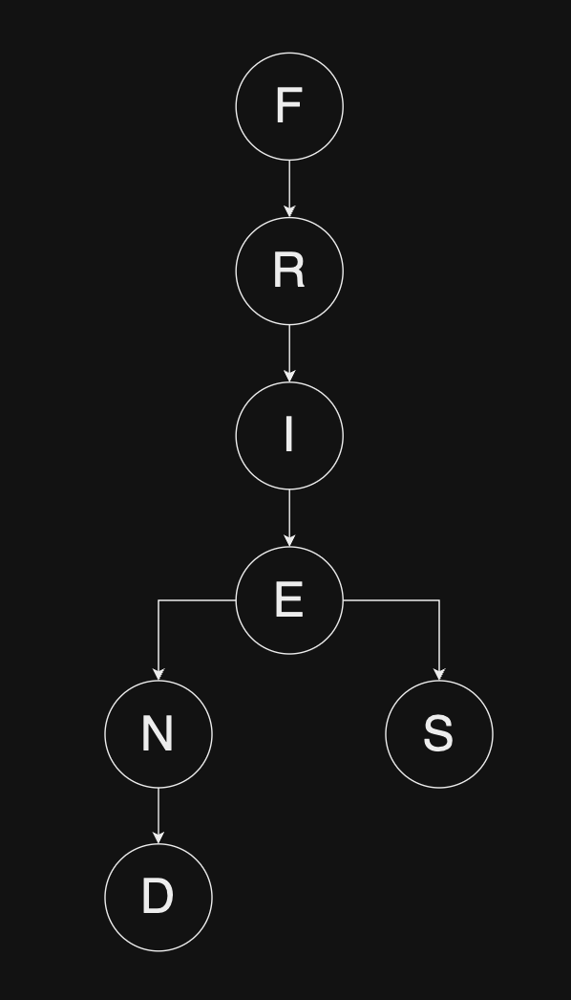

# ❌🈵

### 🧩🤔

I had the chance to complete a crossword puzzle during a recent chaos simulation. I quickly realized codifying the problem would be much more interesting than 'busy-working' it. This one's for all the people who need mental stimulation beyond lifes 'busy-work'.

### 👾🪜
- Map the provided wordlist into a graph. Each node corresponds to a character. Overlapping nodes share the same branch nodes. For example, the words 'friend' and 'fries' looks like :

- loop through the puzzle, stop on any characters that match an existing wordlist tree root (found the 1st letter of a word)
- Search outwards in all directions for the subsequent wordlist tree values

### 🔑

| Emoji | Translation |
|-------|-------------|
| ❌🈵    | crossword   |
| 🧩🤔    | why puzzle? |
| 👾🪜    | algo steps  |
| 🔑     | key         |
