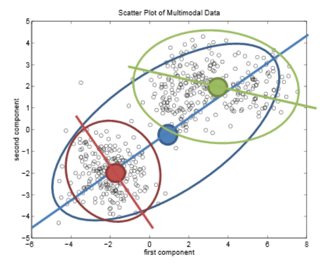

# Color Quantization of Images

This folder contains an implementation of the Orchard Bouman color clustering algorithm.  This algorithm uses a tree structure to quantize the colors in an image into a specified number of clusters.

"The splitting of a node into two nodes is equivalent to
choosing two new quantization levels, and associating each member of the cluster with the closer quantization level. This, in turn, is equivalent to selecting a
plane which best splits the cluster's colors. In the proposed algorithm, we determine the direction in which the
cluster variation is greatest, and then split the cluster with
a plane which is perpendicular to that direction and passes
through the cluster mean. For a large cluster with Gaussian distribution it can be shown that this strategy is optimal." <a id="1">[1]</a> 

## Illustration of color clustering

Illustration of the Orchard-Bouman clustering procedure in 2D data: the whole data set is split into two (red and green) based on the center of distribution (blue dot) and the estimated eigenvector (blue line). <a id="1">[2]</a> 

## References

<a id="1">[1]</a> 
Michael T. Orchard, Charles A. Bouman (1991) 
Color Quantization of Images

<a id="1">[2]</a> 
Hailing Zhou, H. Kong, Jose M. Alvarez, Saeid Nahavandi (2014). 
Fast Road Detection and Tracking in Aerial Videos
